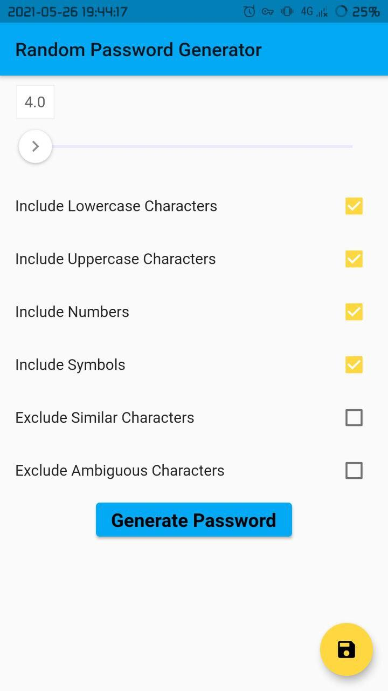
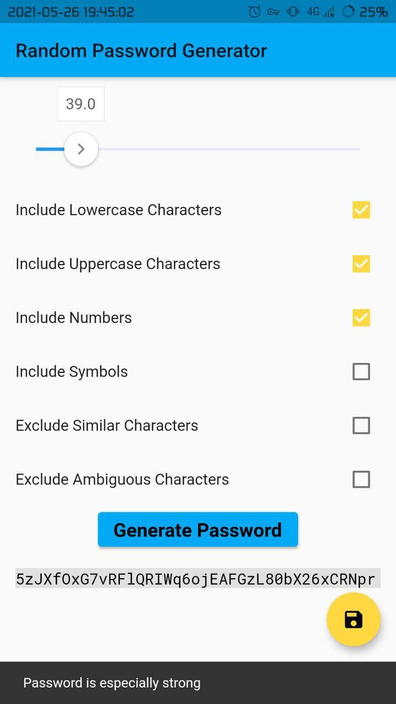
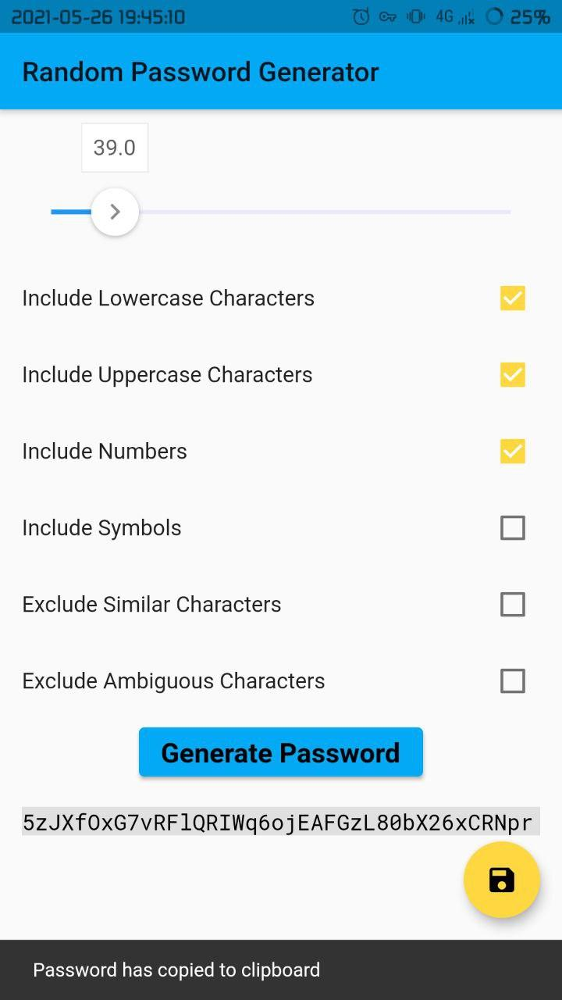

# Random Password Generator

A Flutter app that generate different passwords

## Functions

It have ability to use different characters:  
- lowercase (a-z)  
- uppercase (A-Z)  
- symbols (!, #, " etc)  
- numbers (0-9)

Also it can exclude:  
- similar (like 0-O, 1-l and others)  
- ambiguous (~,;:.{}\<\>\[\]\(\)/\'`)

Can copy password to clipboard

Can estimate password strength

## Screenshots

## License

>                     GNU GENERAL PUBLIC LICENSE
>                        Version 3, 29 June 2007
>  
>   Copyright (C) 2007 Free Software Foundation, Inc. <https://fsf.org/>
>   Everyone is permitted to copy and distribute verbatim copies
>   of this license document, but changing it is not allowed.
