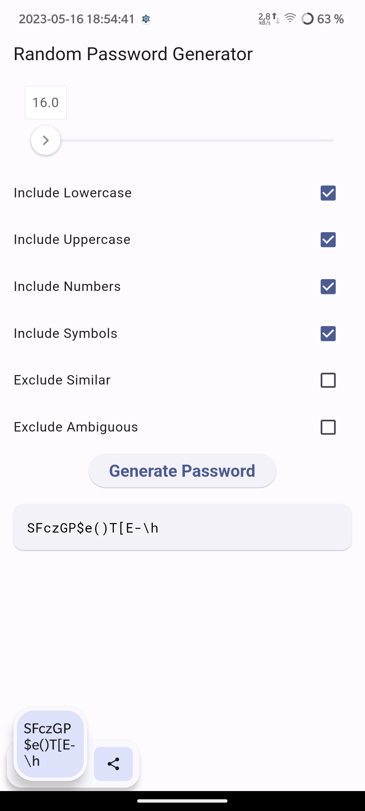
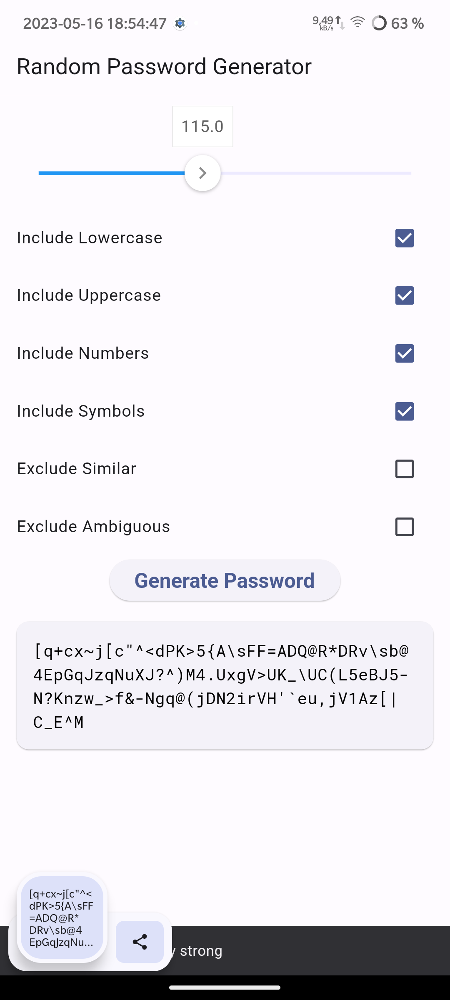
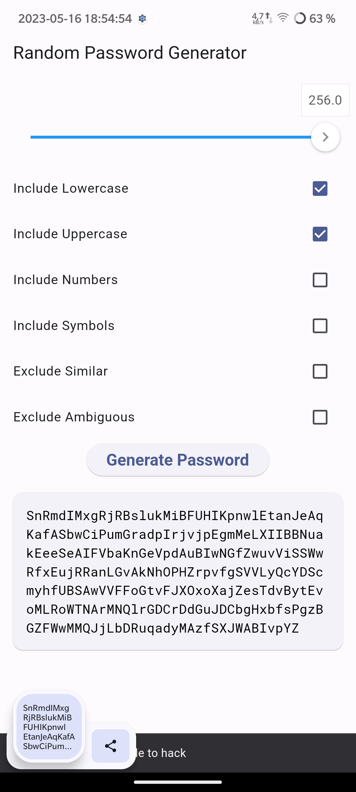

# Random Password Generator

A Flutter app that generate different passwords

## Functions

It have ability to use different characters:

- lowercase (a-z)
- uppercase (A-Z)
- symbols (!, #, " etc)
- numbers (0-9)

Also it can exclude:

- similar (like 0-O, 1-l and others)
- ambiguous (~,;:.{}\<\>\[\]\(\)/\'`)

Can copy password to clipboard

Can estimate password strength

## Screenshots

## License

Source code available under [GNU GENERAL PUBLIC LICENSE](https://www.gnu.org/licenses).
